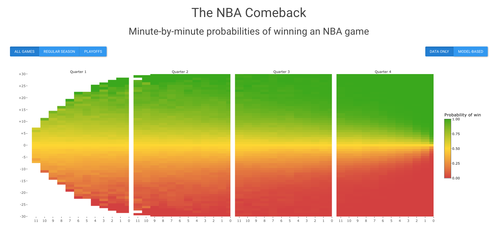

# nba_comeback
This is a project where I calculate the minute-by-minute probabilities of a team winning an NBA game given how many points they are down and how many minutes are left in the game. Read more about the project on my [blog post](https://blog.albertkuo.me/post/probability-of-winning-an-nba-game-a-minute-by-minute-breakdown) or view the [Shiny app](https://albertkuo.shinyapps.io/nba_comeback/).

### Code Organization 

* `main.R` - This is the main script that calls a series of functions to perform various steps in data cleaning and analysis.
  * `download_data.R` - wrapper for Python functions
    * `download_data.py` - functions to download data using the [`nba_api`](https://github.com/swar/nba_api) Python package
  * `clean_data.R` - clean play-by-play data
  * `smooth_data.R` - calculate smoothed probabilities
  * `model_data.R` - calculate binomial probabilities
  * `plot_data.R` - plot heatmaps
* `app/app.R` - Shiny app

